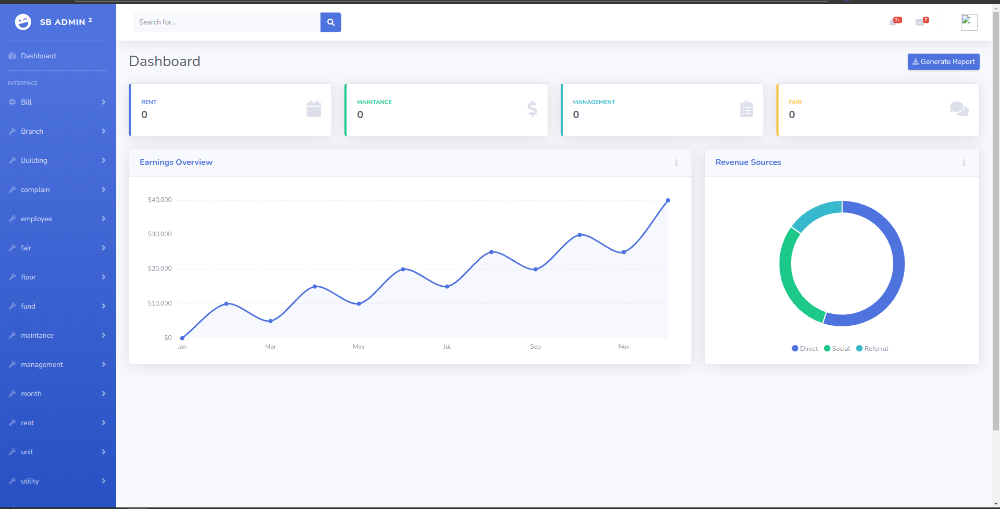

### Apartment
Apartment django


#### Cara Instalasi
```
pip install pipenv

pipenv shell or pip install -r requirements.txt

python manage.py runserver

```

#### Demo



#### Teknologi yang digunakan
- Django
- Pillow
- Pipenv